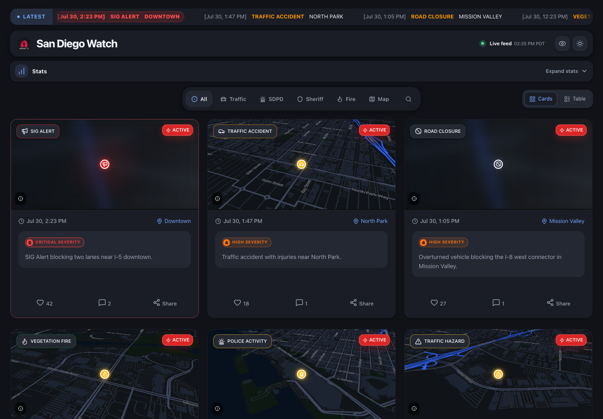
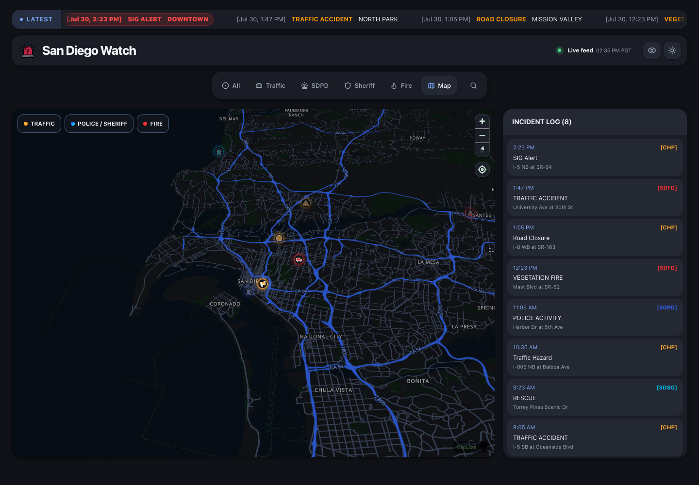
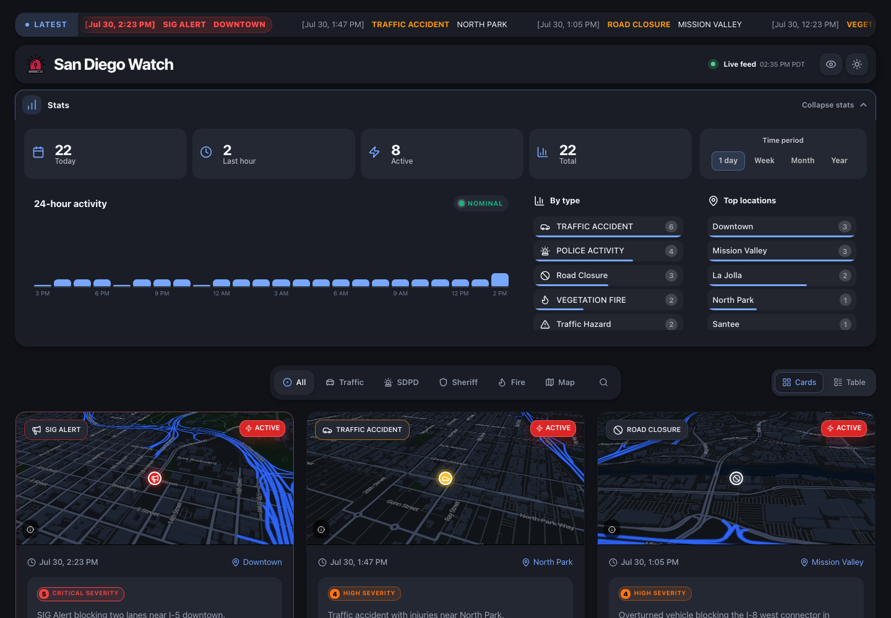

# San Diego Traffic Watch

<div align="center">
  
</div>

San Diego Traffic Watch is a Flask plus Svelte application that ingests live public-safety and traffic incidents across San Diego County, stores them in SQLite, enriches them with geocoding and AI-generated summaries, and serves both the public site and operational metrics from the same backend.

## Overview

The repo has three main pieces:

- `traffic_scraper.py` starts the Flask app and the continuous background scraper loop.
- `traffic-app/` contains the Svelte frontend that is built into `traffic-app/dist` and served by Flask in production.
- `metrics-app/` is a separate static dashboard that reads from the same backend APIs for operational visibility.

## Current Features

- Aggregates incidents from CHP, SDPD, SDFD, and optionally SDSO when `SDSO_API_URL` is configured.
- Runs continuous scrape cycles every 15 seconds and marks stale incidents inactive when they fall out of source feeds.
- Stores incidents, likes, comments, geocoding cache entries, and API analytics events in SQLite with WAL mode enabled.
- Geocodes non-coordinate incidents with cached lookups, Nominatim first, and ArcGIS fallback constrained to the San Diego region.
- Generates incident summaries and 1 to 5 severity scores through OpenRouter via the OpenAI SDK.
- Shows new incidents immediately with Mistral Nemo summaries, then refines each
  five-minute incident batch with Gemini 2.5 Flash-Lite using strict structured output.
- Supports per-device likes and up to two comments per incident using a persistent UUID cookie.
- Serves incident statistics, operational dashboard metrics, and health checks over JSON endpoints.
- Renders interactive frontend maps with MapLibre plus local PMTiles assets instead of remote static map images.
- Includes backup, restore, geocoding catch-up, mock-data, and deployment helpers in `scripts/` and `deploy/`.

## Screenshots

| Dashboard | Map View | Analytics |
| --- | --- | --- |
|  |  |  |

## Architecture

- Backend: Flask app in [traffic_scraper.py](traffic_scraper.py), route handlers in [routes.py](routes.py), background scrape loop in [monitor.py](monitor.py)
- API infrastructure: bounded TTL caching, keyed request coalescing, and rate limiting in [api_support.py](api_support.py)
- Statistics queries and chart buckets: [traffic_stats.py](traffic_stats.py)
- Frontend: Svelte 5 plus Vite in [traffic-app](traffic-app)
- Metrics UI: static dashboard in [metrics-app](metrics-app)
- Database: SQLite file at `traffic_data.db`
- SQLite lifecycle: deterministic commit, rollback, and connection cleanup in [sqlite_utils.py](sqlite_utils.py)
- Geocoding: cached Nominatim and ArcGIS lookups in [geocoding.py](geocoding.py)
- LLM summaries: OpenRouter-backed client in [llm.py](llm.py)

## Requirements

- Python 3.10+
- Node.js 18+
- `npm`

## Setup

Clone the repo, create a virtual environment, and install backend dependencies from the project root:

```bash
cd /home/ubuntu/projects/san-diego-traffic-watch
python3 -m venv venv
source venv/bin/activate
pip install -r requirements.txt
```

Install frontend dependencies:

```bash
cd /home/ubuntu/projects/san-diego-traffic-watch/traffic-app
npm install
```

Optional: install the Playwright workspace used for UI and API smoke tests:

```bash
cd /home/ubuntu/projects/san-diego-traffic-watch/tests
npm install
npx playwright install
```

## Running Locally

### Backend only

Use this when you want the API and scraper loop without the Vite dev server:

```bash
cd /home/ubuntu/projects/san-diego-traffic-watch
source venv/bin/activate
TESTMODE=true python3 traffic_scraper.py
```

The Flask app serves on `http://127.0.0.1:5002` if you set `TRAFFIC_APP_HOST=127.0.0.1`.

### Frontend dev mode

Run the Flask backend separately, then start Vite from `traffic-app/`:

```bash
cd /home/ubuntu/projects/san-diego-traffic-watch/traffic-app
npm run dev
```

Useful frontend scripts:

- `npm run dev`: Vite dev server on port `5173`
- `npm run dev:local`: Vite bound to `127.0.0.1`
- `npm run dev:proxy`: Vite proxied to `https://sandiegotraffic.com`
- `npm run dev:backend`: starts the backend in `TESTMODE`
- `npm run build`: production build to `traffic-app/dist`
- `npm run preview`: preview the production bundle

### Production-style local run

Build the SPA and let Flask serve the compiled assets:

```bash
cd /home/ubuntu/projects/san-diego-traffic-watch/traffic-app
npm run build
cd ..
source venv/bin/activate
python3 traffic_scraper.py
```

## API Surface

### Read endpoints

- `GET /api/incidents`: paginated incident feed with filters for `limit`, `cursor`, `type`, `location`, `source`, `active_only`, and `date_filter`
- `GET /api/incident_stats`: aggregated counts, top locations, chart data, and scrape/runtime metrics for `day`, `week`, `month`, or `year`
- `GET /api/dashboard_metrics`: production-facing operations and engagement metrics used by `metrics-app/`
- `GET /api/user/check`: returns the device UUID used for likes and comments
- `GET /api/healthz`: lightweight backend health response with scrape freshness
- `GET /maps/<filename>`: serves generated map assets if present

### Write endpoints

- `POST /api/incidents/<incident_id>/like`: like an incident
- `DELETE /api/incidents/<incident_id>/like`: remove a like
- `POST /api/incidents/<incident_id>/comment`: add a comment with a two-comment-per-device limit

The backend applies in-memory read and write rate limiting and caches read responses for short TTL windows.

## Database and Background Jobs

The app initializes SQLite automatically on startup and creates these tables as needed:

- `incidents`
- `likes`
- `comments`
- `api_events`
- `geocode_cache`
- `reverse_geocode_cache`

Scrape and enrichment behavior:

- Source scrapers run concurrently every 15 seconds.
- A failed source is isolated from stale-incident cleanup, so an upstream outage cannot clear that source's live incidents.
- New incidents are inserted quickly, then description refreshes continue in the background.
- Immediate descriptions use `mistralai/mistral-nemo`. Incidents are persisted in
  a restart-safe queue and refined in non-empty five-minute batches by
  `google/gemini-2.5-flash-lite`.
- CHP incidents usually arrive with coordinates already present.
- SDPD, SDFD, and SDSO incidents are geocoded when coordinates are missing.
- `generate_map.py` is now a legacy no-op; the frontend renders mini-maps client-side from coordinates and local PMTiles data.

Batch refinement can be tuned with environment variables:

- `BATCH_LLM_ENABLED` defaults to `True`.
- `BATCH_LLM_MODEL` defaults to `google/gemini-2.5-flash-lite`.
- `BATCH_LLM_INTERVAL_SECONDS` defaults to `300`.
- `BATCH_LLM_MAX_ITEMS` defaults to `100`.
- `IMMEDIATE_LLM_MODEL` defaults to `mistralai/mistral-nemo`.

## Scripts

Operational helper scripts live in [scripts](scripts):

- `python3 scripts/backup_db.py`: create a consistent WAL-safe backup in `backups/` and retain the newest three copies
- `python3 scripts/restore_db.py`: restore the newest backup
- `python3 scripts/restore_db.py backups/traffic_data_<timestamp>.db`: restore a specific backup
- `python3 scripts/catchup_geocoding.py`: backfill coordinates for older incidents that still need geocoding
- `python3 scripts/add_mock_data.py`: seed historical mock incidents for dashboard or UI testing
- `python3 scripts/update_db.py`: normalize older incident type values in the database

Stop the backend before running a restore so the live SQLite file is not being written during the copy.

## Testing

Python tests use the standard-library `unittest` runner and cover API support primitives, batch enrichment, incident persistence, geocoding, statistics, and source-failure handling. They do not make live network calls.

Playwright coverage in [tests/README.md](tests/README.md) covers:

- UI workflows
- API contract checks
- accessibility smoke tests
- edge cases
- release-readiness checks

Common commands:

```bash
cd /home/ubuntu/projects/san-diego-traffic-watch
python3 -m unittest discover -s tests -p "test_*.py" -v

cd /home/ubuntu/projects/san-diego-traffic-watch/tests
npm test
npm run test:ui
npm run test:api
```

## Deployment Notes

Production deployment artifacts live in [deploy](deploy):

- `deploy/traffic-app.service` runs the Flask backend and scraper on `127.0.0.1:5002`
- `deploy/nginx-traffic-app.conf` fronts the public traffic site
- `deploy/nginx-metrics.duffyadams.com.http.conf` and `deploy/nginx-metrics.duffyadams.com.conf` front the metrics dashboard
- `deploy/DEPLOYMENT.md` and `deploy/METRICS_DEPLOYMENT.md` document the production layout

The main service expects:

- repo path: `/home/ubuntu/projects/san-diego-traffic-watch`
- virtualenv: `/home/ubuntu/projects/san-diego-traffic-watch/venv`
- env file: `/home/ubuntu/projects/san-diego-traffic-watch/.env`

## Project Layout

```text
san-diego-traffic-watch/
├── config.py
├── api_support.py
├── db.py
├── geocoding.py
├── llm.py
├── logger.py
├── monitor.py
├── routes.py
├── runtime_metrics.py
├── sqlite_utils.py
├── traffic_stats.py
├── traffic_scraper.py
├── scrapers/
├── scripts/
├── deploy/
├── metrics-app/
├── tests/
├── traffic-app/
│   ├── src/
│   ├── public/
│   ├── dist/
│   └── package.json
└── traffic_data.db
```

## License

See [LICENSE](LICENSE).
